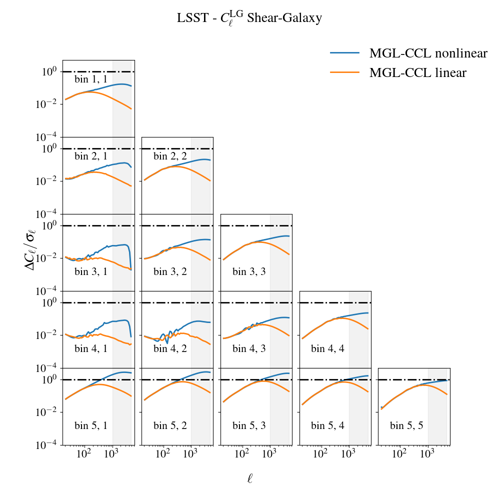

Comparison with the Core Cosmology Library (CCL)
================================================

We compare theoretical prediction for LSST Y1 setup between MGL and `CCL <https://ccl.readthedocs.io/en/latest/index.html>`_. 
We pick some fiducial :math:`\Lambda \mathrm{CDM}` cosmology, linear bias constant within a bin, 
nonlinear intrinsic alignment and `BACCO-emulator <https://baccoemu.readthedocs.io/en/latest/>`_ for nonlinear prescription.
Despite different extrapolation routines between MGL and CCL for high wave-numbers and
redshifts outside of BACCO's range, we reach a very good agreement:

Errorbars are computed from a Gaussian analytical covariance, shaded areas correspond to some arbitrary scale-cuts. 
The differences between extrapolation routines are demonstrated below. CCL assumes halofit for nonlinear power spectrum with :math:`z>1.5`, 
while MGL either uses HMcode2020 or linear power spectrum from BACCO. 

One can perform further comparison test by modifying and running ``plotting_scripts/compare_mgl_vs_ccl.py``.