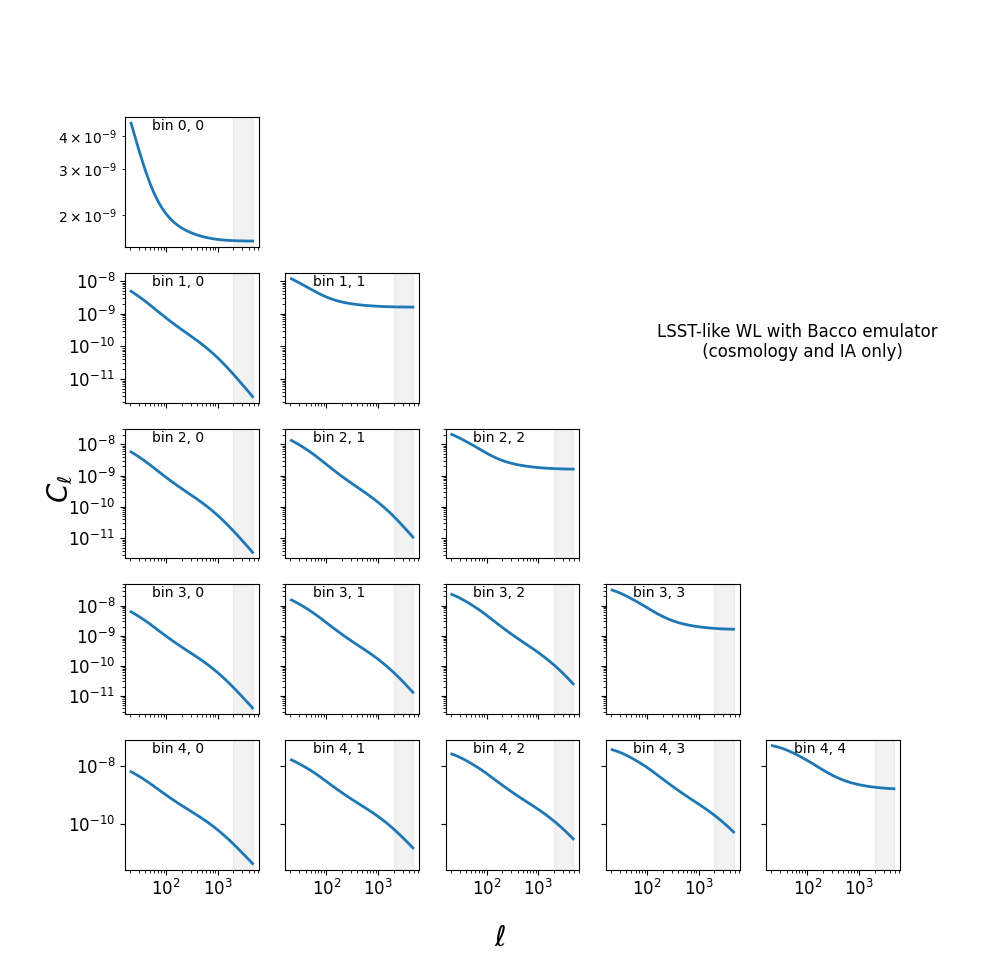
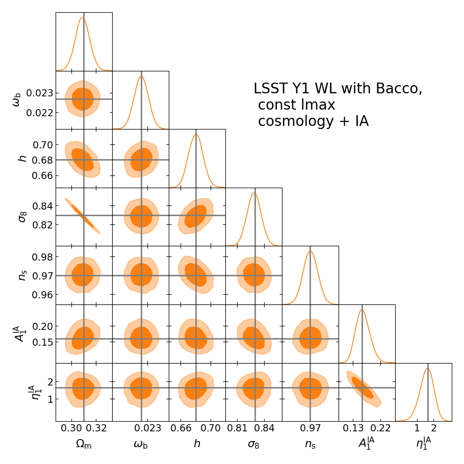

Quickstart
==========

Here we show one simple use of MGL explaining the basic usage of ``test_run.py`` and ``test_mcmc_run.py``.

(Add briedf explanation of what the code does/timeline of computed quantities)

Let us start considering only weak gravitational lensing as dark matter tracer, using `BACCO-emulator <https://baccoemu.readthedocs.io/en/latest/>`_ .
The choice of emulators and models need to be written in the file ``config.yaml`` as follows:

.. code-block:: yaml

    observable: 'WL'

    data:
        type: 0
        data_file: 

    nl_model: 1  # Bacco
    bias_model: 0  # constant linear bias
    ia_model: 0  # NLaz
    baryon_model: 0  # no baryonic feedback
    photoz_err_model: 0  # no photo-z error in n(z)
    params: ./params_data.yaml

    theory:
    nl_model: 1
    bias_model: 0
    ia_model: 0
    baryon_model: 0
    photoz_err_model: 0
    params: ./params_analysis_test.yaml

Please refer to the complete file to see all options and sections not listed here. For this example we choose to vary cosmological 
and intrinsic alignment parameters, considering no baryonic feedback and no photo-z error on the sources and lenses distribution.

The fiducial values to build the mock data has to be written in ``params_data.yaml``, while ``params_bacco_test.yaml`` contains 
the parameter prior ranges and the shape of the prior. Here is an example for the parameter :math:`\Omega_m`:

set the fiducial value as ``Omega_m: 0.31``, 

and the prior type and range as 

.. code-block:: yaml
    
    Omega_m:
        type: 'U'  # uniform prior
        p0: 0.31   # value if parameter is fixed
        p1: 0.2    # prior lower limit
        p2: 0.4    # prior upper limit 
  

We are now ready to run the two scripts. ``test_run.py`` will use the function ``test()`` which constructs a dictionary of test parameters, 
checking that all parameters we specified are inside the allowed ranges of the emulators.
It then computes the log-likelihood using these parameters and measures the time taken for this computation. 
The results, including the log-likelihood value and the time taken, are saved to a text file in ``/chains``. This is how a chain file will lok like:

.. code-block:: python

    #         ##############################################################
    #         # Cosmology Pipeline Configuration
    #         #------------------------------------------------------------
    #         # model choiches as observables, emulator, scale cuts, ... are listed here
    #         # 
    #         # Data model settings
    #         # list of fiducial parameters
    #         # 
    #         # Theory model settings
    #         # list of paramneter priors
    #
    #         ##############################################################
    #              columns with sampled parameters, log_w, log_l and their values
    #
    #         # log_Z = value;  chain_time = value in s (--> value in hh:mm:ss)

In addition, one could also easily calculate and plot the :math:`C_\ell`. For this simple example it would look like:

where the grey bands represent the (constant) scale cuts in :math:`\ell`.

The test code ``test_mcmc_run.py`` will instead build a mock catalogue and then run a full MCMC chain analysis with 
`nautilus sampler <https://nautilus-sampler.readthedocs.io/en/latest/index.html>`_ using 
parameters, priors and models specified in the input files. The full corner plot with all posterior distributions 
can be plotted with ``potting_scripts/plot_posterior.py``. The result is a corner plot as the following one: 

